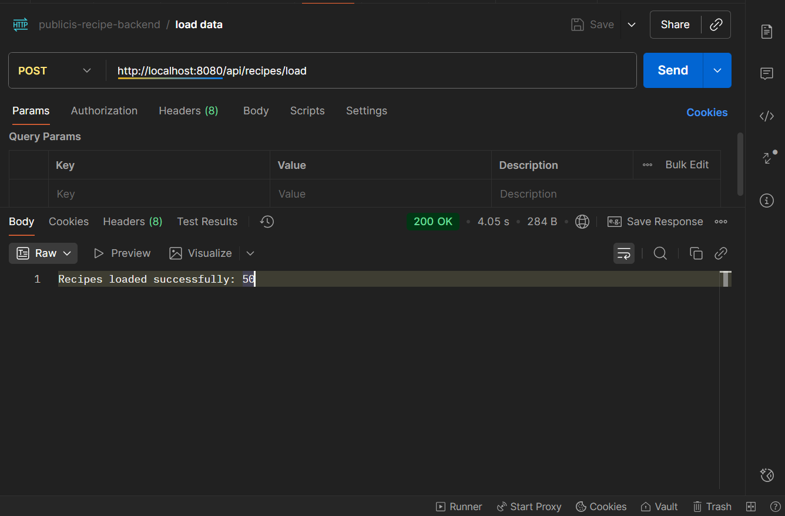
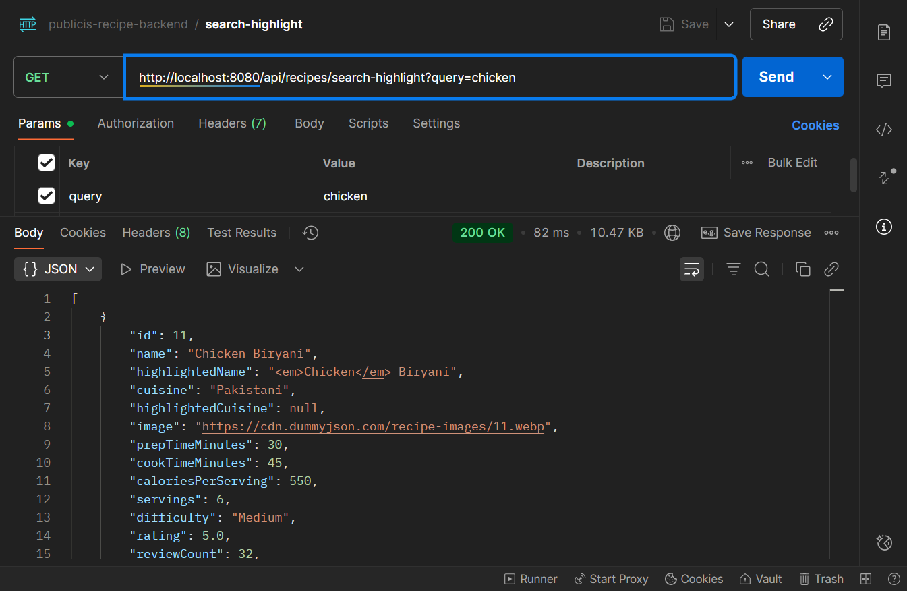
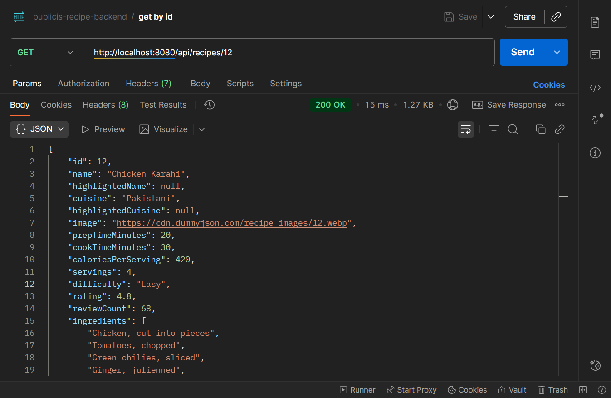
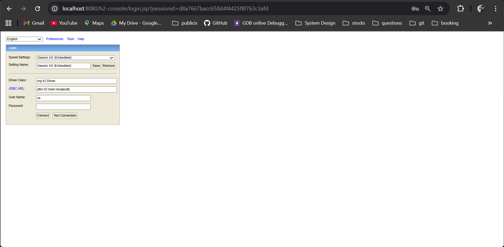
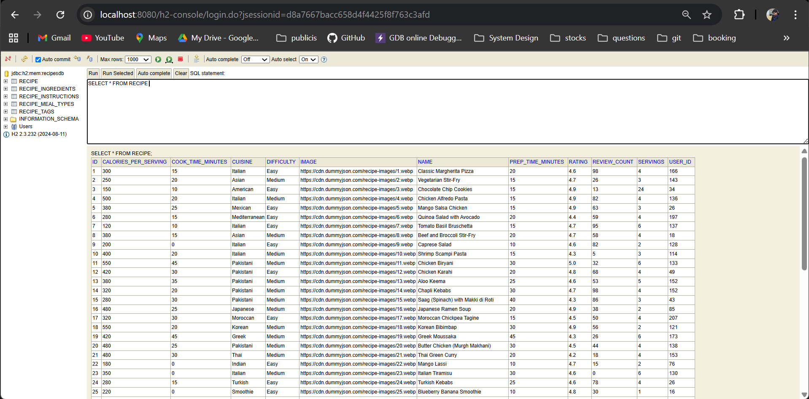
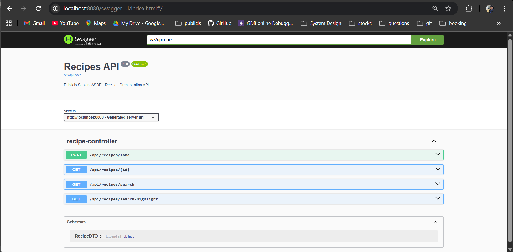

# 🍳 Recipes API - Spring Boot Backend

This is the **backend service** for the *Recipes Finder App*, developed as part of the **Publicis Sapient ASDE Assessment**.  
It exposes REST APIs to **load, search, and fetch recipe details** with Hibernate Search (Lucene) integration for full-text search.

---

## 🖼️ API & Console Screenshots

### 📦 Load Data from External API
The application fetches data from an external recipes API and stores it in the embedded **H2 database**.



---

### 🔍 Search API with Highlighting
Full-text search powered by **Hibernate Search + Lucene**, with support for fuzzy matching and highlighted keywords.



---

### 📗 Get Recipe by ID
Retrieve a single recipe with complete details using the `/api/recipes/{id}` endpoint.



---

### 🗄️ H2 Database Console
View loaded recipes in the embedded in-memory H2 database.

| H2 Console Login | Data Table |
|------------------|-------------|
|  |  |

---

### 📘 Swagger API Docs
All endpoints are documented and testable via **Swagger UI**.



---

## 🚀 Features

- **Load recipes** from external API (`dummyjson.com`)
- **Store recipes** in an H2 in-memory database
- **Full-text search** powered by Hibernate Search + Lucene
- **Fuzzy search & highlighting** for better UX
- **Swagger/OpenAPI integration**
- **Retry mechanism** using Resilience4j
- Clean layered architecture (`Controller → Service → Repository`)

---

## 🏗️ Tech Stack

| Layer | Technology |
|-------|-------------|
| Framework | Spring Boot 3.5 |
| Language | Java 17 |
| Persistence | Spring Data JPA + Hibernate ORM |
| Database | H2 (in-memory) |
| Search | Hibernate Search (Lucene backend) |
| Resilience | Resilience4j (Retry mechanism) |
| Documentation | Springdoc OpenAPI (Swagger UI) |
| Build Tool | Maven |

---

## ⚙️ Setup & Run Locally

### 1️⃣ Clone the repository
```bash
git clone https://github.com/shakya-rohit/recipes-backend.git
cd recipes-backend
```

### 2️⃣ Build and run the Spring Boot app
```bash
mvn spring-boot:run
```

### 3️⃣ Access available endpoints
| URL | Description |
|-----|-------------|
| [http://localhost:8080/swagger-ui.html](http://localhost:8080/swagger-ui.html) | Swagger UI documentation |
| [http://localhost:8080/h2-console](http://localhost:8080/h2-console) | H2 Database Console |

---

## 🧩 Key Endpoints

| Method | Endpoint | Description |
|---------|-----------|-------------|
| `POST` | `/api/recipes/load` | Loads recipes from external API and saves to H2 |
| `GET` | `/api/recipes/search?query=` | Performs full-text search |
| `GET` | `/api/recipes/{id}` | Fetch recipe by ID |

---

## 🧠 Architecture Overview

```
com.publicis.recipes
├── controller       → Handles API endpoints
├── service          → Business logic & external API calls
├── repository       → JPA layer for DB interactions
├── model            → Entity classes
├── config           → Swagger, WebClient/RestTemplate, etc.
└── exception        → Global exception handling
```

---

## 🧾 API Flow

1. `/api/recipes/load` fetches recipe data from the external source.
2. Recipes are mapped to entities and saved in H2.
3. Hibernate Search indexes them using Lucene.
4. `/api/recipes/search` enables fuzzy keyword search across indexed data.

---

## 🧰 Dependencies

- `spring-boot-starter-web`
- `spring-boot-starter-data-jpa`
- `spring-boot-starter-validation`
- `spring-cloud-starter-circuitbreaker-resilience4j`
- `hibernate-search-mapper-orm`
- `hibernate-search-backend-lucene`
- `springdoc-openapi-starter-webmvc-ui`
- `h2`

---

## 📚 Example Swagger Output

### Load recipes
```
POST /api/recipes/load
→ "Recipes loaded successfully: 50"
```

### Search recipes
```
GET /api/recipes/search?query=pizza
→ Returns list of matching recipes with highlights
```
